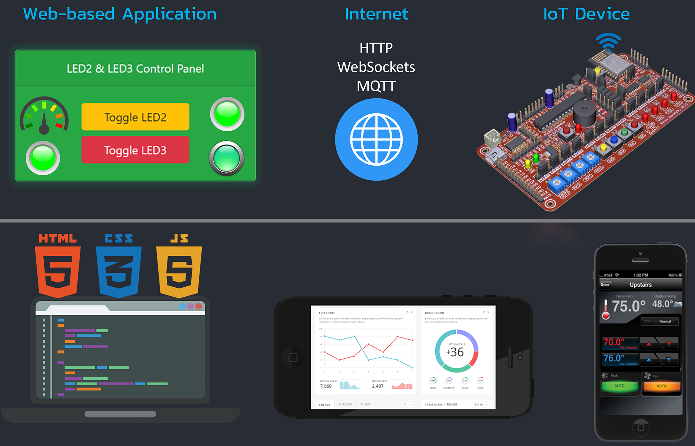

# INC281-2021

News, Documents, Videos and other resources for `INC281` will be provided in this repository.

---

## :movie_camera: Basics

1) [Introduction to INC281 and the first assignment](https://www.youtube.com/watch?v=0dBNmv72LGg)

2) [Basic HTML Programming](https://www.youtube.com/watch?v=T6wu_dAlLjQ)

3) [Basics of CSS and Bootstrap](https://www.youtube.com/watch?v=QPhMT3NKhJI)

4) [Basics of JavaScript Programming](https://www.youtube.com/watch?v=AmM9XckMNQ8)

5) [Install the VSPD and ECC-Uart-WebSockets](https://www.youtube.com/watch?v=4YZTgBoScfg)

6) [Runing the Simulation System](https://www.youtube.com/watch?v=D1nmQegsyFg)

7) [Project Guidelines](https://www.youtube.com/watch?v=-wb7nySQkYc)

---
## :movie_camera: Web-based IoT Applications

8)  [EP01 -- Getting Started with WebGUI Library](https://www.youtube.com/watch?v=UEgXrGnTlSY)

9)  [EP02 -- Buttons and LED Control Functions](https://www.youtube.com/watch?v=EnIe-iAQHk8)

10) [EP03 -- Switches and LED Indicators](https://www.youtube.com/watch?v=_qEUHwlRkbo)

11) [EP04 -- ADCs and Gauge Indicators](https://www.youtube.com/watch?v=04jBAlCHmKU)

12) [EP05 -- ADCs and Plotter Indicators](https://www.youtube.com/watch?v=lh3ohYeUmuc)

13) [EP06 -- Knobs and Pulse Width Modulation](https://www.youtube.com/watch?v=pjoMsKJuioU)

---

## :books: Documents

:page_facing_up: [Google Drive](https://drive.google.com/drive/u/0/folders/1NYmyhDFNeQUjhRiERxDD18_08tZ_aYCm)

---

## :computer: Software tools

:gear: [virtual-serial-port-driver-6.9.rar](resources/software-tools/virtual-serial-port-driver-6.9.rar)

:gear: [ecc-uart-websockets-cli-installer-v1.0.2.rar](resources/software-tools/ecc-uart-websockets-cli-installer-v1.0.2.rar)

> :warning:**Extract** the file and run the installer as **administrator** (Right-click and choose **Run as administrator****)

---

## :dart: Design and build your own IoT application.

---
